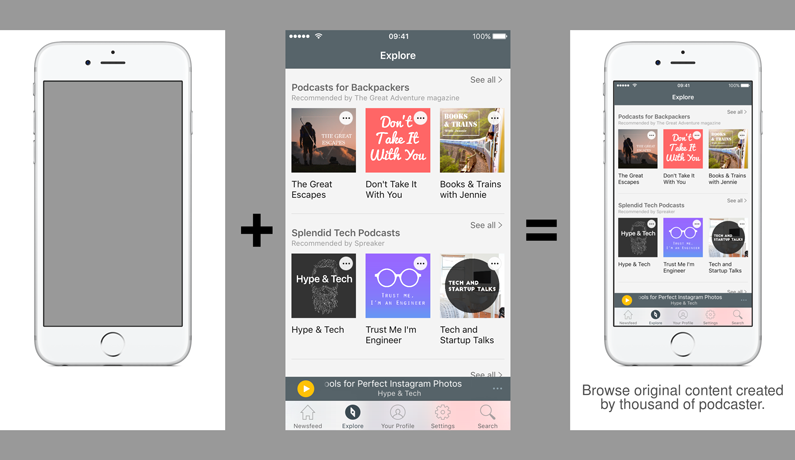

# framer plugin

[](https://rubygems.org/gems/fastlane-plugin-framer)

## Getting Started

This project is a [fastlane](https://github.com/fastlane/fastlane) plugin. To get started with `fastlane-plugin-framer`, add it to your project by running:

```bash
fastlane add_plugin framer
```

## About framer

Create images combining app screenshots to templates to make nice pictures to upload in App Store.



It gives you the freedom to customize the looks of each image (your designers will love that!) while keep their generation fully automated.

Template images can be anything. The only important thing is that it needs to be the same size as the screenshot it will contains.

You can specify the position and the size of the screen in the template and (optionally) the position and size of the text.

## Example

Check out the [example `Fastfile`](fastlane/Fastfile) to see how to use this plugin. 

There are 2 lanes, one for a simple flow (`demo-1`) and another with more languages and screens (`demo-2`).

Try them by cloning the repo, running `fastlane install_plugins` and `bundle exec fastlane demo_1` or `bundle exec fastlane demo_2`. 

## Configuration

> From great customizations come great configurations [files]

In order to work, you need to configure each template and the text to draw in the final images.

### Template Configuration

In the template folder you choose, there must be a `Config.json` file (see [example](fastlane/demo-1/templates/Config.json)). In there you will found

- a default configuration for all templates
- a custom configuration for each template (if needed).

**default** is, as you guess, the default configuration for all templates (a fallback configuration, if you will).

After that, for each template image you have, you have to put a new map with the same filename as your template image.

There are keys for configuring screeshot and for the text.

```
"iPhone6s": {
  "image": {
    "offset": "+148+172",
    "width": 457
  },
  "text": {
    "offset_y": 1123,
    "height": 210,
    "size": 48
  }
}
```

#### Image

| Key            | Type     | Description        |
| -------------- | --------:| ------------:|
| `offset`       | String   | Pixel position in the format `+[X value]+[Y value]` |
| `width`        | Number 	  | space available, in pixel, for the screen |

#### Text

| Key            | Type     | Description        |
| -------------- | --------:| ------------:|
| `offset_x`     | Number   | X position of the text block |
| `offset_y`     | Number   | Y position of the text block|
| `height`       | Number   | height of the text block |
| `size`         | Number   | font size |
| `font`         | String   | path of custom font file to use |
| `color`        | String   | color for the text in hex format (ex. `#545454`) |
| `padding`      | Number   | horizontal internal padding of the text block |

### Screenshots Text

If you want some text in the final framed images, you need to create a `text.json` file and put it with the raw device screenshots. It makes sense to commit this file in your repository.

`text.json` is a simple map where *key* is the part of the screenshot filename (I suggest the same string you use with the `snapshot()` command on your UI tests.
The *value* can be any strings.

## Run tests for this plugin

To run both the tests, and code style validation, run
```
rake
```

To automatically fix many of the styling issues, use 
```
rubocop -a
```

## Issues and Feedback

For any other issues and feedback about this plugin, please submit it to this repository.

## Troubleshooting

If you have trouble using plugins, check out the [Plugins Troubleshooting](https://github.com/fastlane/fastlane/blob/master/fastlane/docs/PluginsTroubleshooting.md) doc in the main `fastlane` repo.

## Using `fastlane` Plugins

For more information about how the `fastlane` plugin system works, check out the [Plugins documentation](https://github.com/fastlane/fastlane/blob/master/fastlane/docs/Plugins.md).

## About `fastlane`

`fastlane` is the easiest way to automate building and releasing your iOS and Android apps. To learn more, check out [fastlane.tools](https://fastlane.tools).
